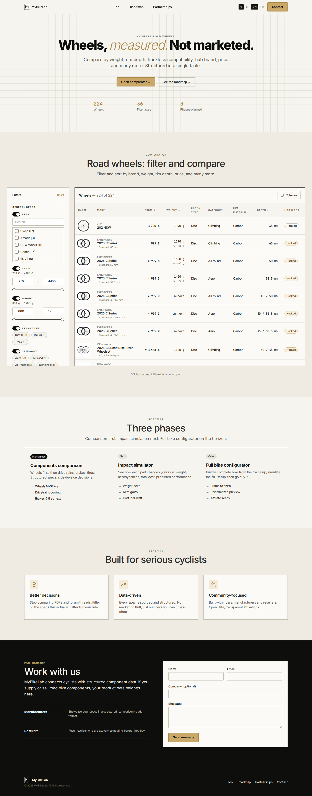
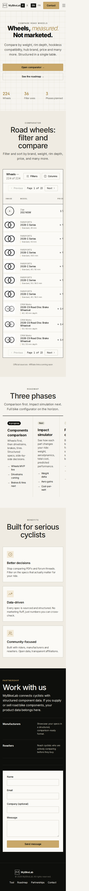
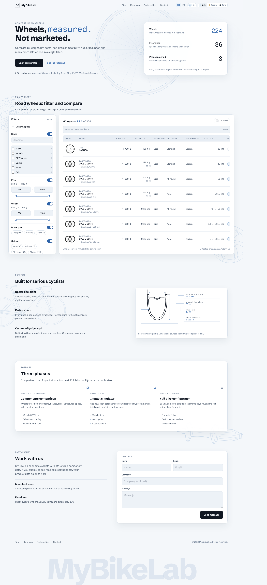
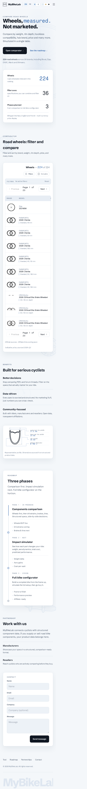

# Archive visuelle — avant/après Wave 5

Cette archive conserve une trace consultable de l’apparence de MyBikeLab avant
la migration Wave 5 et après le polish final. Elle ne contient aucun code
exécuté par le frontend.

## Références

| État | Commit exact | Contexte |
| --- | --- | --- |
| Avant Wave 5 | `e37cfebb65bdbf6dbd9f409d108e8d07046118d9` | Baseline historique pré-migration |
| Après Wave 5 | `eee8b1489fbe995235edd9b886c13a6b195f2a95` | Migration Wave 5 et polish post-migration terminé |

Captures réalisées le **2026-09-02**, avec le catalogue et les ressources
disponibles à cette date, dans Chromium via Playwright, en anglais (`en-US`).
Chaque image couvre la landing complète en mode `fullPage`.

## Captures

### Avant Wave 5

Desktop — viewport CSS `1440 × 900` :



Mobile — viewport CSS `390 × 844` :



### Après Wave 5 et polish

Desktop — viewport CSS `1440 × 900` :



Mobile — viewport CSS `390 × 844` :



## Reproduire les états

Depuis un clone du repository :

```bash
git worktree add --detach ../MyBikeLabLP-before-wave-5 e37cfebb65bdbf6dbd9f409d108e8d07046118d9
cd ../MyBikeLabLP-before-wave-5/frontend
npm ci
npm run dev -- --host 127.0.0.1 --port 4173
```

Pour l’état final, utiliser le commit `eee8b1489fbe995235edd9b886c13a6b195f2a95`
dans un worktree séparé, puis exécuter les mêmes commandes depuis son dossier
`frontend/`.

Ouvrir ensuite `http://127.0.0.1:4173/MyBikeLabLP/` dans Chromium avec les
viewports indiqués ci-dessus. Les captures historiques sont les fichiers
versionnés de cette archive ; une reconstruction ultérieure peut différer si
les dépendances, le navigateur ou les ressources externes ont évolué.

Cette archive est documentaire uniquement : elle est située hors de
`frontend/` et n’est pas incluse dans le bundle ou le runtime produit.
